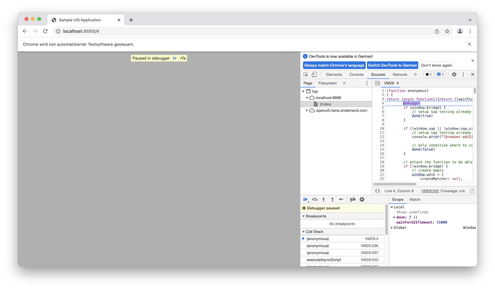

# 🧑‍🍳 Recipes

Here's a collection of "How-To"s for typical use cases in tests and how to do that with `wdi5`.

## navigate an FLP tile

Feasible if your project launches as a mocked Fiori Launchpad (FLP).

Given the FLP is also a UI5 app, `wdi5`‘s standard mechanism of retrieving controls could be used in the tests.

Via the text property matcher, the tile‘s label is located (a `sap.m.Text`).

```javascript
const tile = await browser.asControl({
  selector: {
    properties: {
      text: "SAP Community Profile Picture Editor"
    },
    controlType: "sap.m.Text"
  }
})
```

Then we navigate up the control tree with the help of [`wdi5`'s fluent async api](usage#fluent-async-api) until we reach the tile itself via `.getParent().getParent()`.
A click on it brings us to the linked app itself.

```javascript
// get wdio element reference
const $tile = await tile.getWebElement()
// use wdio api
await $tile.click()
```

Why not locating that tile itself directly?  
Because in most cases it doesn't have a stable ID, and thus its‘ ID might change in the next UI5 rendering cycle - using a locator id such as `__tile0` might break the test eventually then.

## conducting a file upload

First, we utilize `wdi5` to retrieve the file uploader control.

```javascript
const uploader = await browser.asControl({
  forceSelect: true,
  selector: {
    id: "fileToUpload",
    viewName: "profilePic.view.App"
  }
})
```

Then we use `wdio` to get the file `input` element. As per the WebDriver spec, this is the one DOM element capable of receiving a programmatic file upload.

```javascript
// prep the file to upload
const fileName = "wdi5-logo.png" // relative to wdio.conf.(j|t)s
const remoteFilePath = await browser.uploadFile(filePath) // this also works in CI senarios!
// transition from wdi5 api -> wdio api
const $uploader = await uploader.getWebElement() // wdi5
const $fileInput = await $uploader.$("input[type=file]") // wdio
await $fileInput.setValue(remoteFilePath) // wdio
```

Then, typically an "upload"-like button needs to be pressed to trigger file upload.

```javascript
await browser
  .asControl({
    selector: {
      id: "upload",
      viewName: "profilePic.view.App"
    }
  })
  .press()
```

## asserting a file download

This example uses the Chrome to run the test and `chromedriver` offers some custom settings that help preparing things.

The config is set so that

- no download dialog appears
- a static download dir exists

```javascript
// in wdio.conf.cjs
"goog:chromeOptions": {
    prefs: {
        directory_upgrade: true,
            prompt_for_download: false,
                "download.default_directory": join(__dirname, "test", "__assets__")
    }
}
```

Then the download is triggered via pressing the respective UI5 button.

```javascript
// wdi5
await browser
  .asControl({
    selector: {
      id: "downloadButton",
      viewName: "profilePic.view.App"
    }
  })
  .press()
```

After the download completes, standard Node.js mechanisms are used to validate the downloaded file in the static download directory specified.

```javascript
const downloadedFile = join(__dirname, "__assets__", "image.png") // by the books, getting the image name dynamically would be a thing
// stat is from
// const { stat } = require("node:fs/promises")
expect(await (await stat(downloadedFile)).size).toBeGreaterThan(1)
```

## watch the browser window size

## Chrome: auto-open debug tools

For debugging purposes, having the Developer Tools pane open automatically in the remote-controlled Chrome is essential.
For achieving this, add "auto-open-devtools-for-tabs" as `args` to the `chrome` capability:

```js
exports.config = {
  wdi5: {
    // ...
  },
  // ...
  capabilities: [
    {
      maxInstances: 5,
      browserName: "chrome",
      acceptInsecureCerts: true,
      "goog:chromeOptions": {
          ["window-size=1440,800", "--auto-open-devtools-for-tabs"] // <--
      }
    }
  ]
}
```

The browser will be started by `wdi5` with the DevTools immediately available.

## Chrome: run headless

"headless" means running the browser without a GUI.  
In `wdio.conf.(j|t)s`, provide "headless" as `args` to the `chrome` capability:

```js
exports.config = {
  wdi5: {
    // ...
  },
  // ...
  capabilities: [
    {
      maxInstances: 5,
      browserName: "chrome",
      acceptInsecureCerts: true,
      "goog:chromeOptions": {
          ["window-size=1440,800", "--headless"] // <--
      }
    }
  ]
}
```

Note that running headless can still be combined with a dedicated viewport, `1440,800` in the example above.

## DevX: code completion for `wdi5`- and `wdio`-API

In VS Code, use a `jsconfig.json` at the root of your JavaScript-project, at the very least containing

```json
{
  "compilerOptions": {
    "types": ["node", "webdriverio/async", "wdio-ui5-service/dist"]
  }
}
```

See an example at `/examples/ui5-js-app/jsconfig.json` in the wdi5 repository.

## test a `sap.m.ComboBox`

A `sap.m.ComboBox`'s items will only be rendered when it's opened (once).  
So for programmatically working and testing the control, its' `.open()`-method needs to be used:

```js
it("get combobox single item aggregation as ui5 control", async () => {
  const combobox = await browser.asControl(oComboboxSelector)
  await combobox.open() // <--

  const items = await combobox.getItems(4)
  expect(await items.getTitle()).toEqual("Bahrain")
})
```
